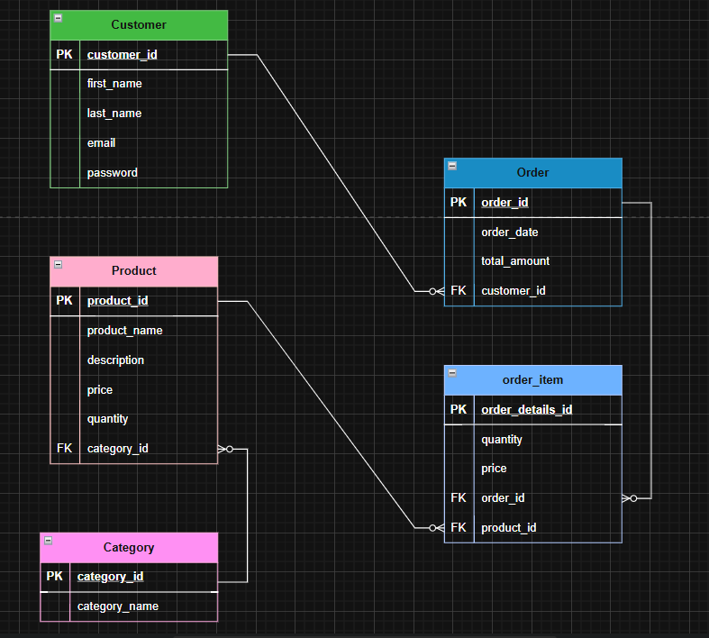

# 🛒E-commerce-Store-DB
 This project demonstrates a basic relational database design for an e-commerce platform using MySQL. It includes an ERD, schema diagram, SQL scripts to create and populate tables, sample reporting queries, and a denormalized version for performance testing.

---

## 📦  Tables and Relationship

 🗂️ **Entities:** 
  - `Customer` 
  - `Product` 
  - `Category`
  - `Orders` 
  - `Order_Details`

### Relationship
 - One to Many between `Category` and `Product`
 - One to Many between `Customer` and `Orders`
 - Many to Many between `Product` and `Orders` via `Order-details`

###  Entity Relationship Diagram
   

---

## 🚀 Features

- ### 📊 Reporting Queries

  - 📅 [Daily Revenue Report](reports/1-daily-revenue.md)

  - 📈 [Monthly Top Selling Products Report](reports/2-Monthly-Top-Selling-Products-Report.md)

  - 💰 [Customers with High Total Purchases](reports/3-Customers-with-High-Total-Purchases.md)

  - 📷 [products-contains-camera-word](reports/4-products-contains-camera-word.md)

- ### Functions
- [Function to insert around 100k rows into the `products` table](functions/function-insert-100k-products.md)

- [Function to insert around 100 rows into the `categories` table](functions/function-insert-100k-products.md)

- [Function to insert around 100k rows into the `customers` table](functions/function-insert-100k-customers.md)

- [Function to insert around 100k rows into the `orders` table](functions/function-insert-100k-customers.md)

- ### 🚀 Performance Tuning

- [Case 1 – Retrieve Total Number of Products in Each Category](Performance-Tuning/case1-number-of-products-each-category.md)

- [Case 2 - Find the top customers by total spending](Performance-Tuning/case2-Find-top-customers-totalSpending.md)

- [Case 3 - Most Recent Orders with customer information](Performance-Tuning/case3-Most-Orders-with-customer-information.md)

- [Case 4 - List products that have low stock quantities](Performance-Tuning/case3-Most-Orders-with-customer-information.md)

- [Case 5 - Revenue generated from each product category.](Performance-Tuning/case3-Most-Orders-with-customer-information.md)

## 💾 Tools  

- **MySQL 8.0+** (or any compatible database engine)  
- **SQL Client or IDE** (e.g., MySQL Workbench, DBeaver, or HeidiSQL)  
